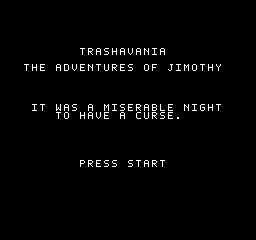
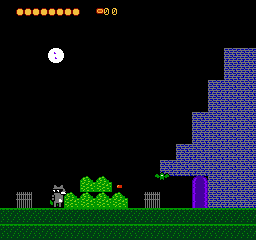
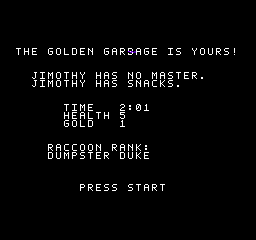

# Trashavania: The Adventures of Jimothy

A complete, playable NES ROM. Gothic comedy action-platformer starring
**Jimothy**, a brave, hungry, questionably hygienic raccoon who must cross
Castle Refuse, recover the legendary Golden Garbage, and defeat the
immortal lord of the castle: **Count Dumpula**.

Built for an AI gaming hackathon. Every byte of code, art, level data and
music was authored in this repo — no copyrighted assets.






## Play it

The ROM is `trashavania.nes` (Mapper 2/UxROM, CHR RAM, NTSC). Load it in
any decent NES emulator (Mesen2 recommended, fceux works) or flash it to
an Everdrive-style cart.

| Input | Action |
|---|---|
| D-pad Left/Right | Walk |
| D-pad Down | Crouch (raccoon scrunch) |
| A | Jump (hold for full height; short tap = short hop) |
| B | Raccoon Swipe (breaks bags, candles; deflects projectiles) |
| Up + B | Throw equipped trash weapon (costs snacks) |
| Start | Pause |

**Snacks** are ammunition. Enemies and containers drop them. The **Bottle
Cap** (found in the Recycling Crypt) flies straight and costs 1 snack; the
**Rotten Tomato** (found in the Chapel) arcs and leaves a damaging splat
zone, costing 2. Half-Eaten Burritos heal. The hidden **Golden Garbage** in
the Tower of Cans boosts your ending rank.

The journey: Garbage Grove → Recycling Crypt → Tower of Cans → Chapel of
Questionable Leftovers → The Moonlit Dumpster, where Count Dumpula waits.
His lid slams where you stand, his garbage arcs at random, his trash bats
harass you — he is only vulnerable when his glowing interior opens.
Finish to receive your **Raccoon Rank** (time, health and loot all count).

## Build it

```sh
brew install cc65 fceux     # toolchain + test emulator
make                        # -> build/trashavania.nes
make run                    # open in Mesen2 (see SETUP.md to install it)
make run-fceux
```

All art, levels and music are authored as ASCII art / note strings in
`tools/genassets.py`, which compiles them to C arrays (`src/assets.c`)
and renders PNG previews to `build/preview/`. `make` regenerates assets
automatically when the generator changes.

## Architecture

- **Mapper 2 (UxROM), CHR RAM.** 4×16KB PRG banks; the fixed bank holds
  all code, bank 0 holds bulk data (CHR tiles, room maps, songs) and is
  selected once at reset with a bus-conflict-safe write.
- **cc65 C** with one hand-written 6502 file (`src/crt0.s`: iNES header,
  reset, NMI). Hot globals live in zero page via `#pragma bss-name`.
- **Fixed-screen rooms**: 16×15 metatile grids (16×16 px metatiles with
  per-tile palette + collision class), drawn during masked door
  transitions. One metatile = exactly one attribute-table quadrant.
- **Fixed entity pools** (no allocation): 6 enemies, 4 pickups, 3+3
  projectiles, 2 effects, 1 boss — struct-of-arrays for fast 6502 indexing.
- **8.8 fixed-point physics** with input buffering, coyote time and
  variable jump height.
- **Vblank-budgeted rendering**: OAM DMA + a batched VRAM write queue are
  committed only when PPUSTATUS confirms the CPU is genuinely inside
  vblank, so an overlong logic frame can never corrupt the nametable.
- **Audio driver**: pulse 1 melody, pulse 2 harmony, triangle bass, noise
  drums; SFX borrow a channel by priority and hand it back. Songs are
  compiled from note strings at build time.

## Verification

Headless, scripted playthroughs in fceux
(`tools/probe.lua` + `tools/playthrough.sh`): scripted input, RAM
assertions on zero-page state, PPM screen dumps, and memory-wait
checkpoints that sync the script to live game state (room index, boss
phase). The shipped ROM completes power-on → title → all five rooms →
Count Dumpula (12 hits through his weak-point windows) → Golden Garbage →
victory ranking, plus death/restart, pause, and both weapons, entirely
under scripted play. See `DEVLOG.md` for the build history and the bugs
the probes caught.

*"Jimothy has no master. Jimothy has snacks."*
